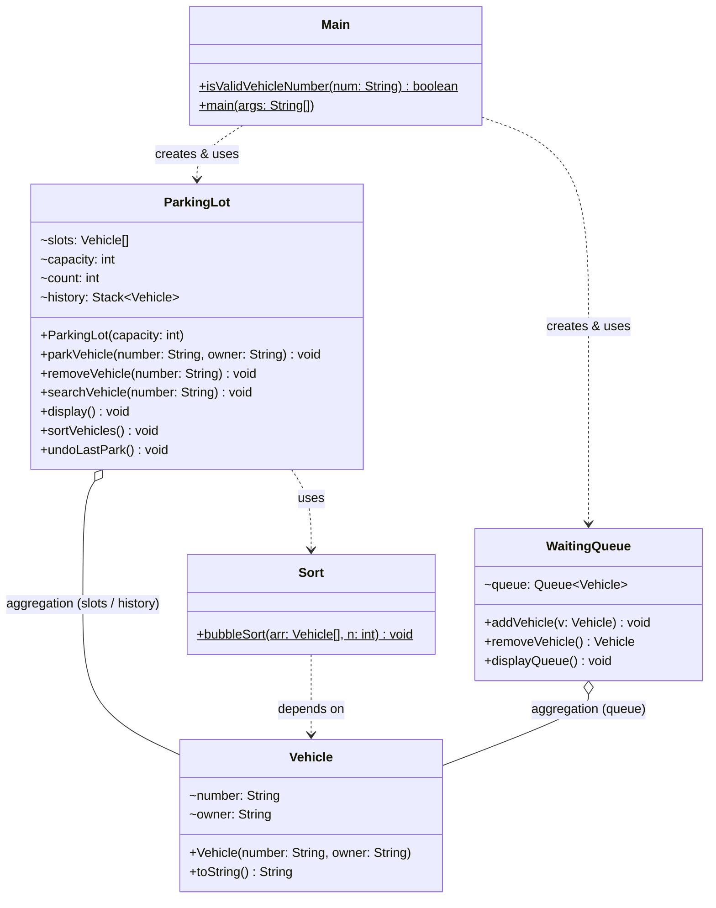

# UML Diagram for Parking Slot Management System

```mermaid
classDiagram
    class Main {
        +isValidVehicleNumber(num: String) boolean$
        +main(args: String[])$
    }

    class ParkingLot {
        ~slots: Vehicle[]
        ~capacity: int
        ~count: int
        ~history: Stack~Vehicle~
        +ParkingLot(capacity: int)
        +parkVehicle(number: String, owner: String) void
        +removeVehicle(number: String) void
        +searchVehicle(number: String) void
        +display() void
        +sortVehicles() void
        +undoLastPark() void
    }

    class Sort {
        +bubbleSort(arr: Vehicle[], n: int) void$
    }

    class Vehicle {
        ~number: String
        ~owner: String
        +Vehicle(number: String, owner: String)
        +toString() String
    }

    class WaitingQueue {
        ~queue: Queue~Vehicle~
        +addVehicle(v: Vehicle) void
        +removeVehicle() Vehicle
        +displayQueue() void
    }

    Main ..> ParkingLot : creates & uses
    Main ..> WaitingQueue : creates & uses
    ParkingLot o-- Vehicle : aggregation (slots / history)
    WaitingQueue o-- Vehicle : aggregation (queue)
    ParkingLot ..> Sort : uses
    Sort ..> Vehicle : depends on
```
